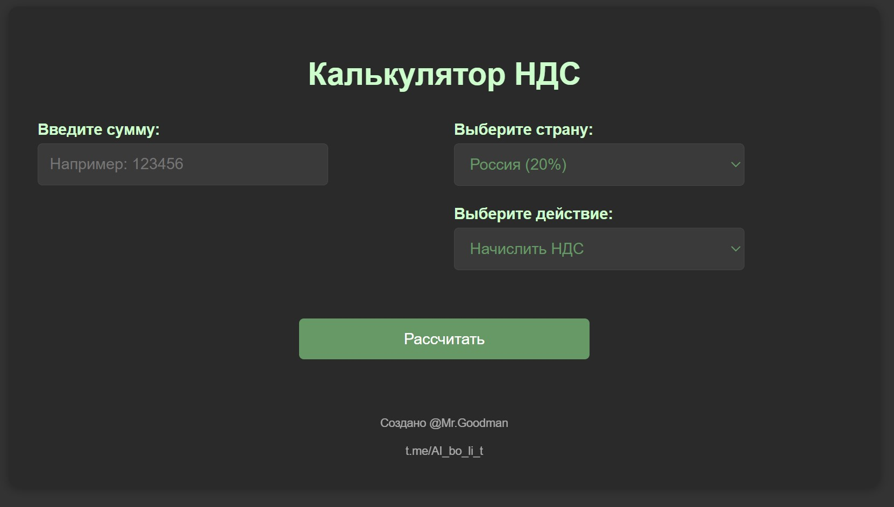
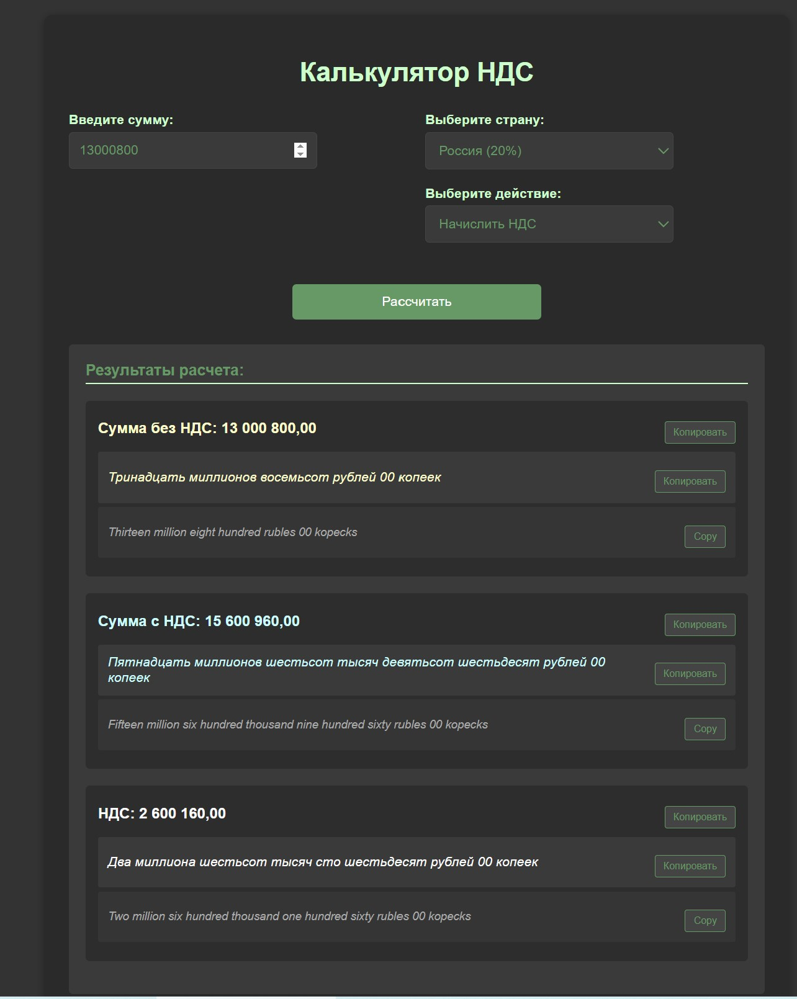
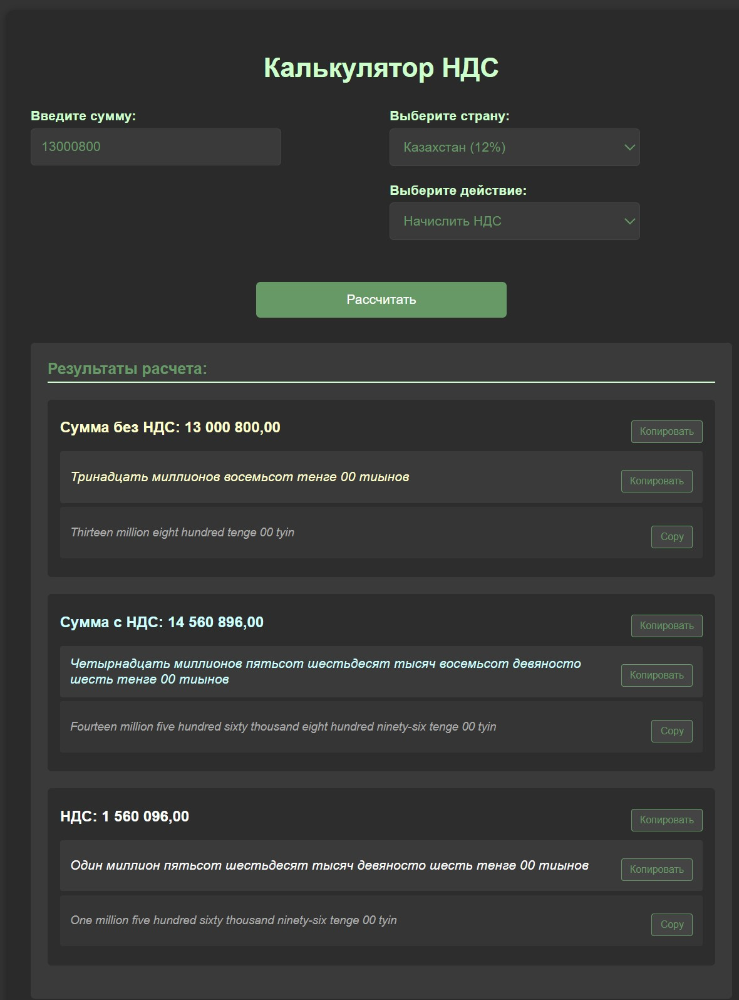

# 🧮 Калькулятор НДС для разных стран

## 📌 О проекте

**Calculator VAT** - Удобный и функциональный калькулятор для расчета НДС с поддержкой разных стран и валют. Приложение автоматически преобразует числовые значения в текст на русском и английском языках.

## 🎯 Проблема

На просторах интернета существует множество различных калькуляторов: финансовые, математические, спецефические (калорий, размеров одежды).
Конечно же, можно воспользоваться готовыми, зачем изобретать своё. Но...
Доступные варианты не всегда способны удовлетворить потребности во всех нюансах деятельности.
Вот и в моем случае, в ежедневной рутине мне часто приходится считать суммы с НДС и без, отдельно НДС, и дублировать все числа прописью на 2-х языках, русском и английском.
К тому же НДС нужно считать как для РФ, так и РК (Казахстан), а НДС у них разные и, порой, я забывал менять его. К тому же мне приходилось постоянно переводить прописные числа в переводчике, не забывая при этом менять валюту вручную.
В общем, рутина отнимающая время и требующая внимательности в мелочах.

Так у меня и родилась идея объединить процессы в одном приложении-калькуляторе для удобства расчетов и освобождения времени.

---

## 🌟 Основные возможности

- **Расчет НДС** для разных стран (Россия 20%, Казахстан 12%, Беларусь 20%)
- **Два режима расчета**:
  - Начисление НДС
  - Выделение НДС из суммы
- **Мгновенное преобразование** чисел в текст на русском и английском языках
- **Копирование результатов** в буфер обмена одним кликом
- **Адаптивный дизайн** с темной темой
- **Горячие клавиши** (Enter для расчета)
- **Мультивалютность** (рубли/копейки, тенге/тиыны)

## 🖥️ Демонстрация



Интерфейс калькулятора

---



Пример расчета для РФ

---



Пример расчета для РК

---

## 🚀 Начало работы

### Варианты использования:

1. **Веб-версия**: Откройте `Calculator_VAT.html` в любом браузере

### Локальный запуск:

```bash
# Скачайте репозиторий
git clone https://github.com/ваш-логин/nds-calculator.git
```

# Откройте Calculator_VAT.html в браузере

### 🛠️ Используемые технологии

- HTML5/CSS3 - структура и стилизация
- JavaScript (Vanilla) - основная логика
- number-to-words - библиотека для преобразования чисел в текст на английском
- Собственный алгоритм - для преобразования чисел в текст на русском

### 📱 Особенности интерфейса

- Темная цветовая схема (#333333 фон, #669966 текст)
- Цветовая кодировка результатов:
- Сумма без НДС: #ffffcc (светло-желтый)
- Сумма с НДС: #ccffff (светло-голубой)
- НДС: #ffffff (белый)
- Адаптивный дизайн для разных экранов
- Кнопки копирования для каждого результата

### 🎯 Пример использования

Введите сумму: 123456
Выберите страну: Россия (20%)
Выберите действие: Начислить НДС
Нажмите Рассчитать или Enter

**Результат:**

Сумма без НДС: 123 456.00 рублей
Сумма с НДС: 148 147.20 рублей
НДС: 24 691.20 рублей
Текстовый формат:

*Сто двадцать три тысячи четыреста пятьдесят шесть рублей 00 копеек*


*One hundred twenty-three thousand four hundred fifty-six rubles 00 kopecks*


*Создано с ❤️ для упрощения бухгалтерских расчетов*


